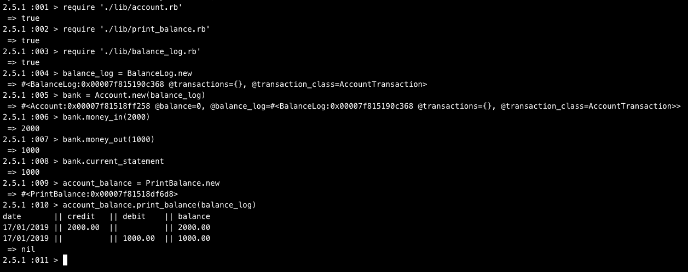

# Bank Tech Test

Requirements
-----
* You should be able to interact with your code via a REPL like IRB or the JavaScript console. (You don't need to implement a command line interface that takes input from STDIN.)
* Deposits, withdrawal.
* Account statement (date, amount, balance) printing.
* Data can be kept in memory (it doesn't need to be stored to a database or anything).

## Acceptance criteria

```
Given a client makes a deposit of 1000 on 10-01-2012
And a deposit of 2000 on 13-01-2012
And a withdrawal of 500 on 14-01-2012
When she prints her bank statement
Then she would see

date       || credit  || debit  || balance
14/01/2012 ||         || 500.00 || 2500.00
13/01/2012 || 2000.00 ||        || 3000.00
10/01/2012 || 1000.00 ||        || 1000.00

```
## Approach

I employed the single responsibility principle in my design.
I created four clearly named classes which only do one specific thing. For example the 'print_balance' class only prints the balance. I chose this design approach because I felt that if the application needed to scale, or be modified in someway, it would be easier to make those changes.

```
Play on the irb:
$ irb
2.5.1 :001 > require './lib/account.rb'
 => true
2.5.1 :002 > require './lib/print_balance.rb'
 => true
2.5.1 :003 > require './lib/balance_log.rb'
 => true
2.5.1 :004 > balance_log = BalanceLog.new
 => #<BalanceLog:0x00007fe9eb9a0420 @transactions={}, @transaction_class=AccountTransaction>
2.5.1 :005 > bank = Account.new(balance_log)   
 => #<Account:0x00007fe9ec093318 @balance=0, @balance_log=#<BalanceLog:0x00007fe9eb9a0420 @transactions={}, @transaction_class=AccountTransaction>>
2.5.1 :006 > bank.money_in(2000)
 => 2000
2.5.1 :007 > bank.money_out(1000)
 => 1000
2.5.1 :008 > bank.current_statement
 => 1000
2.5.1 :009 > account_balance = PrintBalance.new
 => #<PrintBalance:0x00007fe9eb98b6d8>
2.5.1 :010 > account_balance.print_balance(balance_log)
date       || credit   || debit    || balance
17/01/2019 || 2000.00  ||          || 2000.00
17/01/2019 ||          || 1000.00  || 1000.00
```

## Screenshot of application



## To Use
```
* Clone Repo
git clone https://github.com/githubsttar/BankTechTest.git
cd BankTechTest
run bundle
```

## Technologies used and version
```
ruby version 2.5.1
rspec
rubocop 0.39.0

```
